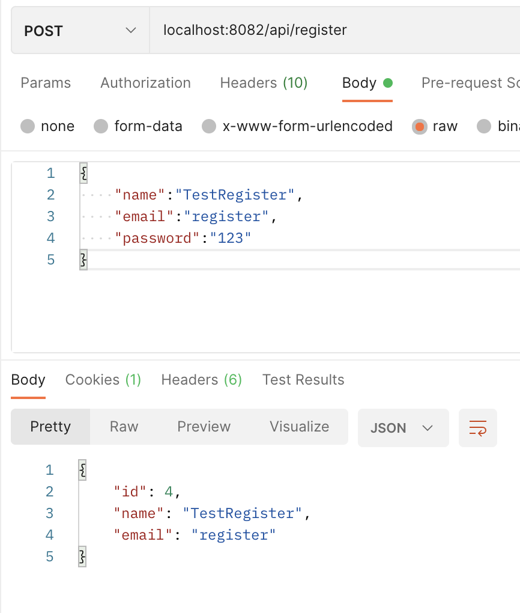
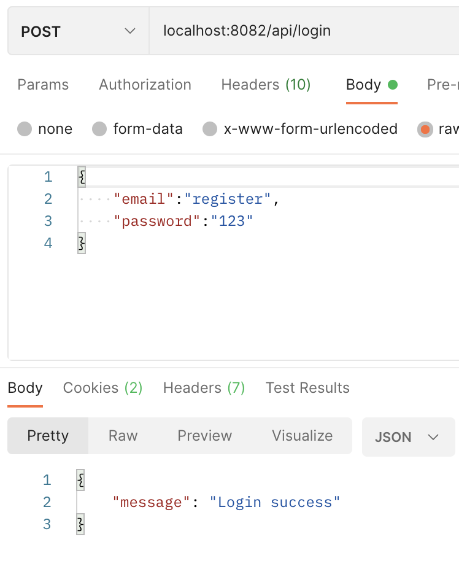
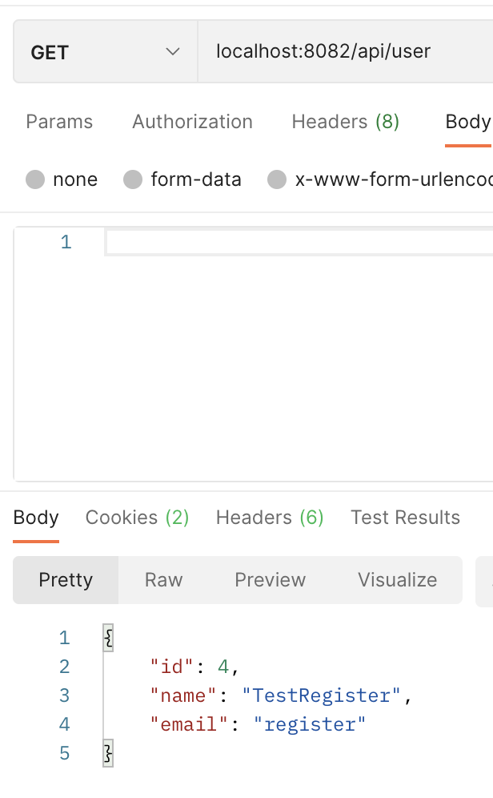
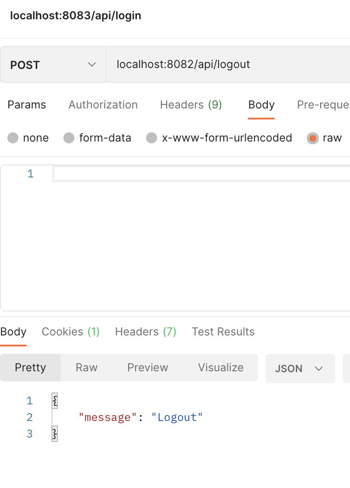
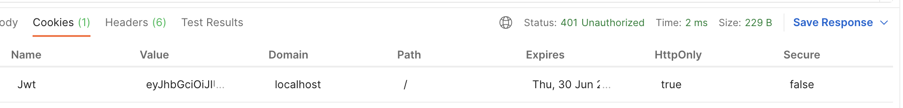

# Golang-Fiber-RestAPI using JWT

### Starting (M1-ARM64)

```
go mod tidy

```

## .env File

>You need to create a .env config file.

```env
DB_CONN="root:*******@/dbName" #DB conf 
SECRET_KEY="test_secret_key" #JWT Secret Key
PORT=":8082" #Port to listen
```

#

```
Register

Post localhost:8082/api/register

```

<p>
    

</p>

#

```
Login

Post localhost:8082/api/login

```

<p>
    

</p>

#

```
Get UserInfo

```
> Cookie JWT is saved.
<p>
    

</p>

#

```
Logout

Post localhost:8082/api/logout

```
> User information is deleted from the cookie.
<p>
    

</p>


# Cookie

<p>
    

</p>


####  Thank You Scalable Scripts
